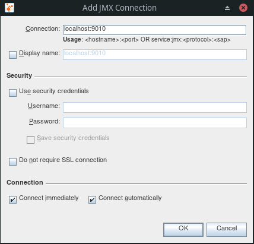

# Quarkus Joy

## Usando VisualVM no container Docker

https://visualvm.github.io/ 

### 01 Build da imagem Docker

```
docker build -f src/main/docker/Dockerfile.fast-jar -t quarkus/quarkus-joy-jvm .
```

### 02 Executanto imagem Docker com parametros para possibilitar a monitoria com VisualVM 

```
docker run -i --rm \
    --memory=1000m \
    --cpus=2 \
    -e QUARKUS_LAUNCH_DEVMODE=true \
    -e "JAVA_TOOL_OPTIONS=-Dcom.sun.management.jmxremote -Dcom.sun.management.jmxremote.port=9010 -Dcom.sun.management.jmxremote.rmi.port=9010 -Dcom.sun.management.jmxremote.local.only=false -Dcom.sun.management.jmxremote.authenticate=false -Dcom.sun.management.jmxremote.ssl=false" \
    -p 8080:8080 \
    -p 9010:9010 \
    quarkus/quarkus-joy-jvm
```

### 03 Conectando VisualVM com o imagem Docker

Menu: File -> Add JMX connection...

Inserir no campo "Connection": `localhost:9010`

 
